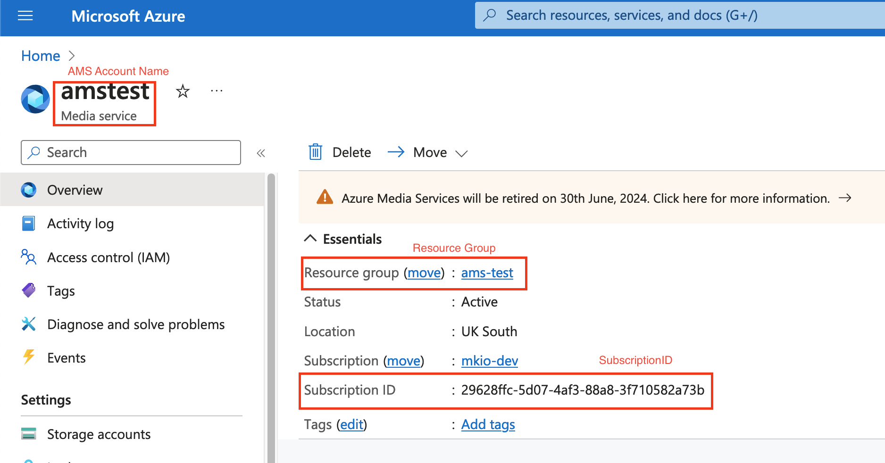
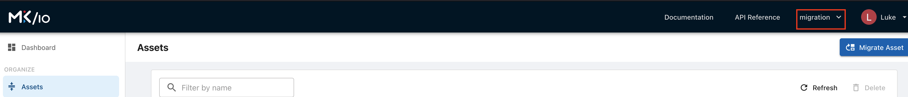

# Setup and Demo for mk.io

## Setup

The following setup steps should result in a running Migration tool

### Binary

1. Build the binary according to the README
2. Copy the binary to your devvm

### Azure

The following steps will setup Azure access and select the desired accounts to migrate

1. Set account to the desired subscription. Using the terminal run `az account set --subscription mkio-dev`
2. Get AMS Account Name, SubscriptionID and Resource Group of the AMS from the UI
    
    1. Login to the Azure Portal
    2. Navigate to your AMS's overview page to get this data
    3. Example: https://portal.azure.com/#@mediakind.com/resource/subscriptions/29628ffc-5d07-4af3-88a8-3f710582a73b/resourceGroups/ams-test/providers/Microsoft.Media/mediaservices/amstest/overview

### mk.io

#### Getting Access

1. Using an Incognito or Private Browser
2. Log into [mk.io UI](https://app.mk.io/)
3. Get the mk.io subscription name from the dropdown in the top pane
    
4. Get the login token [mk.io Token](https://api.mk.io/auth/token/)
5. In terminal, export the token as an environment variable
    `export MKIO_TOKEN="$token_from_step_3"`

### Manual Updates

At the moment we don't automatically migrate the StorageAccount access, or StreamingEndpoints. These will need to be added manually to mk.io.

#### Setup Storage Account

StorageAccount must be in place before the tool runs.

1. Log into the Azure Portal's AMS page
2. Select Settings.Storage Accounts from the side pane
3. These storage accounts will need to be added to mk.io before we can run the migration tool
4. For each storage account:
    1. Record the Name
    2. In the storage account select `Security + networking` -> `Shared access signature` from the side pane
    3. Select all three `Allowed resource types` to have the correct
    4. Make sure your End Time is appropriate.
    5. Click on `Generate SAS and connection string` button.
    6. Record the BlobEndpoint in the `Connection string` setting. It should look similar to `https://amstestrns0.blob.core.windows.net/`
    7. Record the entire `SAS token`
5. Navigate to the appropriate subscription in the mk.io UI
6. Select `Storage Accounts` in the side menu
7. Select `+ Add Storage Account` on top
8. Use Information recorded in step 4 to create a storage account.
    - At the moment this will only work if naming matches exactly between AMS and mk.io

#### Setup Streaming Endpoint

A streaming Endpoint is needed to output video. Imports will work without this, but we will not be able to test.

1. Navigate to the appropriate subscription in the mk.io UI
2. Select `Streaming Endpoints` in the side menu
3. Select `+ Create Streaming Endpoint` on top
4. Create a streaming Endpoint

## Demo

This assumes all of the setup steps above were completed successfully.

### Resetting the demo

The script `dev/removeAssets.sh` will delete all assets from the `migration` subscription in mk.io

### Demo Process

I would suggest testing out assets beforehand to make sure you have one that works. I used `liveEvent-test-alex-20230901-192728` for my demo. Ideally the asset should have a StreamingLocator with `Streaming Policy = Predefined_ClearStreamingOnly`.

1. Login to AMS and show the list of assets
2. Select an asset and play a sample video
3. Log into mk.io and show an empty list of assets
4. Run the Migration
5. Show Assets in mk.io
6. Select the same asset as in AMS
7. Play the sample video of the asset

### Run the migration

Run the migration using the information gathers in Setup

./mkio-ams-migration --azure-subscription 29628ffc-5d07-4af3-88a8-3f710582a73b --azure-resource-group ams-test --azure-account-name amstest --mediakind-import-subscription migration --export --import --assets --streaming-locators --asset-filters --content-key-policies --streaming-endpoints
